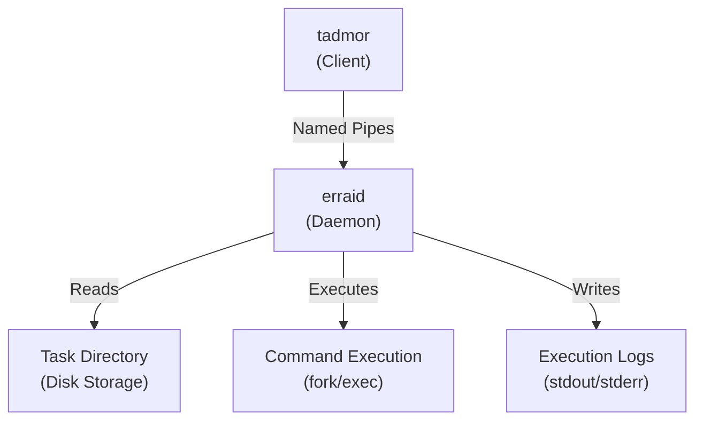

<div align="center">
  <h1>erraid & tadmor</h1>
  <p><strong>A task scheduling daemon-client system for automated command execution.</strong></p>

<p>
    <a href="https://en.wikipedia.org/wiki/C_(programming_language)"></a>
    <a href="https://pubs.opengroup.org/onlinepubs/9699919799/"></a>
    <a href="https://www.gnu.org/software/make/"></a>
    <a href="https://git-scm.com/"></a>
  </p>
</div>

---

**erraid & tadmor** is a Unix-style task scheduler system similar to `cron`, allowing users to automate the execution of complex commands (simple commands, sequences, pipelines, and conditionals) at specified times. The system consists of a daemon (`erraid`) that executes tasks and a client (`tadmor`) that manages them.

## Features

- **Complex Command Support**: Execute simple commands, sequences (`;`), pipelines (`|`), conditionals (`if-then-else, &&, ||`)
- **Flexible Scheduling**: Cron-like scheduling with minute, hour, and day-of-week specifications
- **Persistent Storage**: Task definitions and execution history stored on disk for recovery after restarts
- **Nested Pipelines**: Support for pipelines containing sequences and nested pipelines
- **Execution History**: Track exit codes and capture stdout/stderr for each task execution
- **Named Pipe Communication**: Client-daemon communication via FIFOs for reliable IPC

## Tech Stack

- **Language**: [C](https://en.wikipedia.org/wiki/C_(programming_language))
- **System Calls**: `fork()`, `execve()`, `pipe()`, `dup2()`, `waitpid()`, `open()`, `read()`, `write()`
- **IPC**: Named pipes (FIFOs) for client-daemon communication
- **Build System**: [GNU Make](https://www.gnu.org/software/make/)
- **Serialization**: Custom binary format with big-endian encoding

## Getting Started

### Prerequisites

- A POSIX-compliant Unix-like system (tested on Linux/macOS)
- `gcc` or `clang` compiler
- `make` build tool
- Standard C library and POSIX headers

### Installation

1. **Clone the repository**:
   
   ```bash
   git clone <repository-url>
   cd SY5-Projet
   ```

2. **Build the project**:
   
   ```bash
   make
   ```
   
   This creates both `erraid` and `tadmor` executables in the root directory.

3. **Clean build artifacts**:
   
   ```bash
   make distclean
   ```

### Quick Start

1. **Start the daemon** (in foreground for testing):
   
   ```bash
   ./erraid -F -I -R /tmp/my-erraid
   ```
   
   - `-F`: Run in foreground (no daemonization)
   - `-I`: Execute tasks immediately (for testing)
   - `-R`: Specify run directory

2. **Create a task** (in another terminal):
   
   ```bash
   ./tadmor -c echo Hello, World!
   ```
   
   This creates a task that runs every minute.

3. **List tasks**:
   
   ```bash
   ./tadmor -l
   ```

4. **View execution history**:
   
   ```bash
   ./tadmor -x <TASKID>
   ```

## Usage Examples

### Creating Tasks

```bash
# Simple command (runs every minute)
./tadmor -c echo Hello

# Scheduled task (runs at 9:00 AM every day)
./tadmor -c -H 9 date

# Sequence of commands
./tadmor -s 81 82 83

# Pipeline
./tadmor -p 85 86 87

# Conditional if-then-else
./tadmor -i 88 89 90

# Conditional &&
./tadmor -A 92 93 94

# Conditional ||
./tadmor -O 96 97
```

### Managing Tasks

```bash
# List all tasks
./tadmor -l

# View exit codes history
./tadmor -x 42

# View last stdout
./tadmor -o 42

# View last stderr
./tadmor -e 42

# Remove a task
./tadmor -r 42

# Stop the daemon
./tadmor -q
```

## Architecture

The system follows a modular architecture with clear separation of concerns:



### Components

- **Parser**: Deserializes binary task definitions from disk
- **Executor**: Handles command execution with proper pipe management
- **Daemon Loop**: Monitors timing and executes tasks at scheduled times
- **Communication**: FIFO-based protocol for client requests and daemon responses

### Command Types

- **CMD_SI**: Simple command (e.g., `echo hello`)
- **CMD_SQ**: Sequence (e.g., `cmd1 ; cmd2 ; cmd3`)
- **CMD_PL**: Pipeline (e.g., `cmd1 | cmd2 | cmd3`)
- **CMD_IF**: Conditional (e.g., `if cmd1 ; then cmd2 ; else cmd3 ; fi`)
- **CMD_ND**: Conditional (e.g., `cmd1 && cmd2 && cmd3`)
- **CMD_OR**: Conditional (e.g., `cmd1 || cmd2 || cmd3`)

## Project Structure

```
SY5-Projet/
├── code/
│   ├── erraid/          # Daemon source code
│   │   ├── src/         # Implementation
│   │   ├── include/       # Header files
│   │   └── Makefile    # Build configuration
│   └── tadmor/          # Client source code
│       ├── src/
│       ├── include/
│       └── Makefile
├── docs/
│   └── ARCHITECTURE.md  # Detailed architecture documentation
├── sujet/               # Project specifications (French)
│   ├── enonce.md        # Main specification
│   ├── protocole.md     # Communication protocol
│   └── serialisation.md # Binary format specification
└── Makefile            # Root build file
```

## Development

### Building Individual Components

```bash
# Build only erraid
cd code/erraid && make

# Build only tadmor
cd code/tadmor && make
```

### Debug Mode

Run the daemon with debug output:

```bash
./erraid -F -d -R /tmp/my-erraid
```

### Testing

Test files are located in `test_git/`:

```bash
cd test_git
./autotests.sh
```

## Documentation

- **Architecture**: See `docs/ARCHITECTURE.md` for detailed design decisions
- **Specifications**: See `sujet/` directory for complete project requirements (in French)
- **Protocol**: See `sujet/protocole.md` for client-daemon communication format
- **Serialization**: See `sujet/serialisation.md` for binary data format

## Authors

- **Iyan Nazarian**
- **Theo Polgar**
- **Florian Vincent**

## License

This project is the final project of the Systems Course at [Paris Cité](https://u-paris.fr/) (L3 Informatique - Système).
